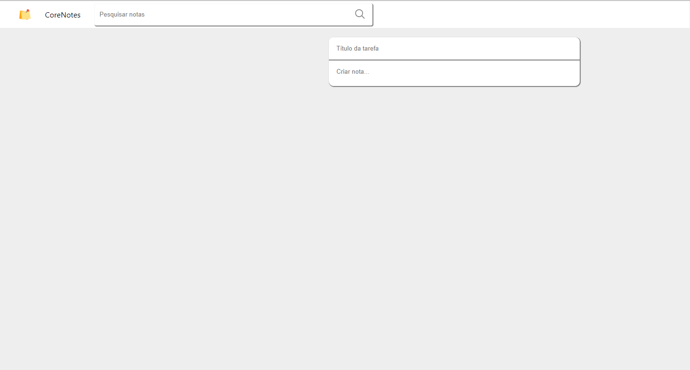

# ToDo List CoreLabs

# Como foi o desenvolvimento do projeto?

O desenvolvimento desse desafio me moldou bastante em como devo encarar um desafio tecnico e trabalhar sobre demanda. Aprendi nesse desafio a separar um periodo maximo para desenvolver cada stack do projeto, e ter que me esforçar para fazer o maximo que eu consegui nesse tempo que eu estipular. Se eu terminar a segunda stack mais rapido e nao tiver terminado a primeira, eu volto nela e faço o que ficou de ser feito.

Esse foi o meu primeiro projeto FullStack que fiz sozinho e , com o meu nível de conhecimento estou bastante satisfeito com o resultado. sabendo que se eu tivesse mais 1 dia , conseguiria fazer 100% dos requisitos do desafio

### 01. Rodando o Projeto

Para rodar o projeto, vamos rodar o back-end primeiro:

1. Abra o terminal no Visual Studio Code ou no proprio cmd.
2. Faça o git clone do projeto 
3. Navegue até o diretório " \corelab-web-challenge\server "
4. Execute o comando " npm i " para instalar todas as dependencias
5. Depois de terminado a instalação e aparecer a pasta "node_modules",execute o comando " npm start " para executar o back end no node.js

Agora rodando o front end:

1. Abra o terminal no Visual Studio Code ou no proprio cmd.
2. Navegue até o diretório " \corelab-web-challenge "
3. Execute o comando " npm i " para instalar todas as dependencias
4. Depois de terminado a instalação e aparecer a pasta "node_modules" ,execute o comando " npm start " para executar o front end

Agora va no navegador e acesse o projeto no link " http://localhost:3000/ "

## Criado por

Criado por mim Fabio Diogo. 

